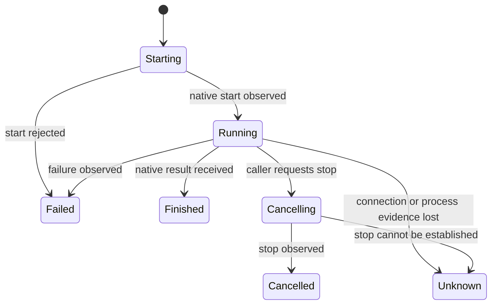

# Small boundary contracts

These are meanings to exercise, not final schemas or universal network APIs. The [stack detail](module-internals-and-stack.md) now proposes concrete implementations and the optional `memory.search`, `memory.read`, `memory.propose` tools. A module may initially be a library or local program; no RPC layer is required merely to call it.

## Inputs and outputs

| Module | Minimum input | Minimum output | Caller supplies during standalone evaluation |
| --- | --- | --- | --- |
| Execution | Objective, workspace access, explicit limits/authority, optional context | Handle, progress, outcome, artifacts and native session reference when available | A bounded request and prepared isolated directory |
| Environments | Isolation/resource requirement, permitted imports | Workspace descriptor, observed status, release operation | Fixture files and ordinary inspection commands |
| Recall | Source reference/revision/content/scope; query over authorized scope | Matches with source evidence, ingestion receipt and limitations | Exported records and known-answer questions |
| Conversation | Conversation reference, turn, optional context | Stored turns and response, provider failure if applicable | Text turns and explicit identity instructions |

The workspace descriptor states where work can run, which resource boundary actually exists, and who can release it. It is not permission by itself. Initially it may describe one local prepared location. Do not design remote scheduling fields until a remote provider exists.

Execution consumes prepared access, not the Environments module's private database or runtime objects. Recall consumes records, not Conversation's private tables. Conversation consumes supplied context, not a particular vector index. This is what allows development to proceed independently.

## Common semantics, without a common platform

- **Ownership:** each module owns its records and references. Optional caller correlation can connect them; global task IDs are not mandatory.
- **Errors:** distinguish invalid input, denied access, unavailable dependency, failed operation and unknown outcome. Do not create a universal error framework before the adapters expose real cases.
- **Evidence:** separate what a provider reported from what was observed. Artifacts can be inspected by a human first; an automatic verifier is not required to use execution.
- **Limits:** enforce the limits advertised by the module. Unsupported limits/capabilities must be rejected or explicitly disclosed before starting, never silently ignored.
- **Persistence:** acknowledge durable storage only after the chosen store commits. Native session IDs are references, not JARVIS identity or a guarantee of recoverability.

## Execution lifecycle to evaluate first

`Finished` means the harness finished, not that the objective was verified. Attach the report/artifacts and verification limits. An unknown outcome is inspected before retrying anything that could have an external effect. Automatic recovery is optional; reporting uncertainty correctly is not.

Environments should distinguish requested state from observed state and release only resources it owns. Recall should acknowledge which source revision was ingested or removed. Conversation should preserve accepted turns and mark incomplete output rather than presenting it as a complete answer. Detailed state machines for these can follow their actual implementations.

## First real connection

1. A manual caller asks Environments for a location.
2. The caller passes its descriptor with a task to Execution.
3. The caller inspects the outcome and artifacts.
4. The caller releases the environment when safe, after preserving requested output.

No orchestrator is necessary to prove this connection. Once it is useful, small composition code can perform those steps. That code owns cleanup when submission fails; it must not delete a workspace while an execution may still be running.

## Change policy

Avoid cross-module imports of private storage/runtime types. Keep fixture examples with each eventual module. When a boundary changes, update its standalone exercise and the real integration that consumes it. Formal schema versioning, remote transports and richer native extensions can be added when there are multiple real consumers to protect.
