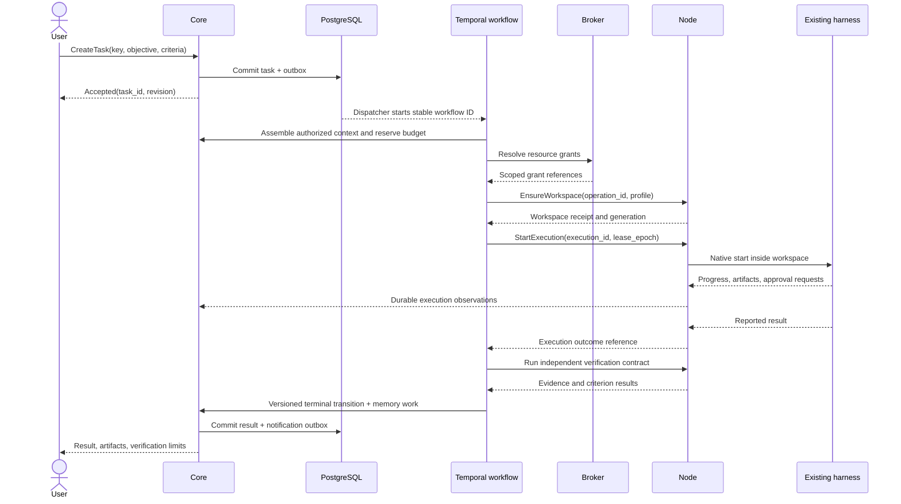
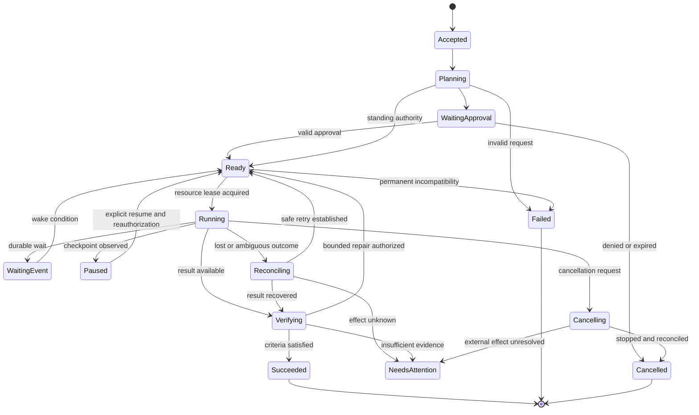
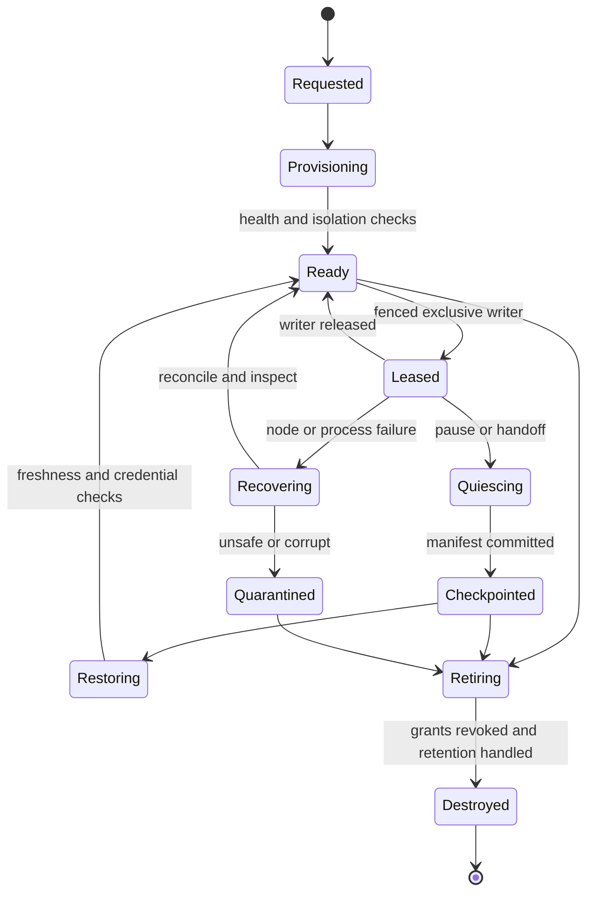

# Contracts, workflows, and lifecycles

Status: proposed interface design, not executable schemas. Common identifiers are opaque globally unique IDs. All timestamps are UTC; schedules also preserve an IANA timezone and daylight-saving policy. Every request is authenticated; owner/compartment fields are resolved by the server, never trusted from a client body.

## 1. Contract boundaries

| Boundary | Proposed operations | Required semantics |
| --- | --- | --- |
| Surface → core | SubmitTurn, CreateTask, SteerTask, CancelTask, DecideApproval, GetChanges | Idempotency key; expected revision for mutations; durable receipt; replay cursor for changes. |
| Core → recall | BuildContext(query, purpose, compartment, asOf, budget) | Permission filtering before ranking; immutable context manifest; source versions and freshness. |
| Workflow → node | EnsureWorkspace, StartExecution, InspectExecution, CancelExecution, CheckpointWorkspace | Stable operation ID, lease epoch, explicit desired-state operations. No arbitrary host shell endpoint. |
| Node → adapter | Discover, Start, Observe, Steer, Cancel, Inspect, Resume | Versioned capabilities; provider-native IDs; bounded buffers and timeouts. Unsupported operation is explicit. |
| Execution → broker | RequestCapability, InvokeAction, ImportArtifact, ExportArtifact | Authenticated workload identity; server-resolved grants; current authorization; receipts. |
| Connector → ingress | AcceptEvent, AdvanceCursor, ReportGap | Acknowledge only after durable ingest; dedup source IDs; source reconnection policy. |
| Worker → memory | ProposeClaims, ValidateClaims, PromoteClaims, RebuildProjection | Idempotency by source revision and extractor version; evidence required. |

These are internal product contracts over existing transports and schemas, not a new public plugin protocol. MCP SDKs handle compatible external tools. ACP is an optional harness adapter transport if its supported feature set is sufficient; native interfaces remain available. [MCP security](https://modelcontextprotocol.io/docs/2025-11-25/tutorials/security/security_best_practices), [ACP overview](https://agentclientprotocol.com/protocol/v1/overview)

## 2. Principal records exchanged

| Contract | Required fields |
| --- | --- |
| TaskSpec | task_id, owner_id, originating_turn/event, objective, acceptance_criteria, project_id?, compartment_id, resource_refs, desired_capabilities, deadline?, budget, standing_mandate_id?, expected_revision |
| ExecutionRequest | execution_id, attempt_id, task_id, workspace_id, workspace_generation, lease_epoch, adapter/version, allowed_model_ref, context_manifest_ref, grant_refs, output_contract, verification_contract, limits, idempotency_key |
| AdapterCapabilities | adapter/version, native_protocol_version, task_classes, model/provider_pairs, streaming, steering, cancel, resume, approval_handshake, usage_reporting, checkpoint_kind, supported_platforms, namespaced_extensions |
| ExecutionObservation | observation_id, execution_id, provider_session/turn, sequence, timestamp, event_kind, artifact_refs, usage_delta?, native_payload_ref?, evidence_level |
| ContextManifest | manifest_id, task/purpose, authorization_revision, source_refs/versions, excluded_compartments, retrieval_plan, as_of, warnings, token_budget, actual_size, model_destination |
| WorkspaceManifest | workspace_id, node_id, substrate, trust_profile, generation, image_digest, resource_limits, volume_refs, restore_kind, checkpoint_ref, native_session_refs, lease_epoch, last_verified_at |
| CapabilityGrant | grant_id, subject_workload/device, owner, task_id, resource_selector, allowed_verbs, destination_constraints, data_class, expiry, usage_limit, policy_revision, revocation_epoch |
| ActionIntent | action_id, task_id, normalized_operation, exact_parameter_digest, target/account, precondition_version, grant_id, risk_class, idempotency_key, expected_effect, verification_plan |
| VerificationResult | verification_id, action/execution_id, criterion_id, verifier/version, observation_refs, observed_at, result(pass/fail/unknown), limitations |

No prompt or tool result can mint or alter a grant. Provider extensions are allowlisted configuration blocks under an adapter namespace; arbitrary flags, environment variables, executable paths and MCP endpoints cannot be smuggled through them. Native payloads are useful diagnostics but remain untrusted, privacy-classified artifacts.

Start returns a durable execution receipt, not a success claim. An adapter that only supports batch execution advertises that limitation; steering creates a successor attempt after reconciliation rather than pretending to modify a running task. Cancellation acknowledges a request; stopped state requires observation of process/cgroup termination and outstanding action reconciliation.

## 3. Event envelope and delivery

Use CloudEvents-compatible envelope semantics through an existing library: specversion, id, source, type, subject, time, dataschema and content type. Add owner/compartment, ingest time, correlation/causation IDs, aggregate revision, trace context, payload reference and sensitivity. Source authenticity comes from the authenticated connector, not the envelope's self-asserted source. [CloudEvents](https://github.com/cloudevents/spec)

Domain mutations write record changes and outbox entries atomically. Dispatcher claims bounded batches, invokes Temporal using stable workflow IDs, and marks delivered only after acknowledgement. A crash after delivery can resend: domain activity inbox uniqueness on `(consumer, event_id)` prevents duplicate effects. Each inbox transition and its domain write occur in the same database transaction. Failed deliveries remain retryable with bounded backoff and quarantine for invalid schemas.

The guarantee is at-least-once delivery plus idempotent handling. Do not claim global event order. Aggregate revisions provide order where needed; delayed observations cannot replace fresher world state without source-specific rules. Source-specific keys are preferred to content hashes; two identical door events may both be legitimate.

High-volume perception frames bypass the domain event log: store selected evidence blobs and observation metadata only. Coalesce filesystem change bursts and perform scans after watcher gaps. Noise must not starve cancellation, approvals or durable task transitions. Database notifications, if used, are wake hints; outbox rows are the durable truth.

## 4. Coding task sequence



Verification runs against the exact output artifact/tree digest. Repository tests are themselves untrusted code and execute in the workspace boundary. Passing tests supports specified criteria; it does not prove arbitrary correctness. A second agent's opinion is not independent evidence when it merely repeats the executor's report.

## 5. Task state versus evidence state



Any nonterminal state accepts a cancellation request; the diagram shows the active-execution path. A terminal task is immutable except annotations; renewed work creates a linked successor. Store state revision and transition cause. Evidence is a separate dimension: planned → attempted → reported_success → observed_success → verified_success. Some outcomes stop at observed_success with disclosed limits; they do not silently satisfy a stronger acceptance criterion. “Unknown” and “failed” are different.

## 6. Workspace lifecycle and ownership



One authority issues monotonically increasing lease epochs. Node and action broker reject stale epochs. A lease expiry blocks new broker actions and tells the node supervisor to stop the execution; a previously accepted external request may still complete. Before retrying on another node, reconcile that possibility. StartExecution is deduplicated against a durable node receipt keyed by execution ID. Process existence is checked using an owned systemd unit/cgroup and execution token, not an arbitrary PID that could be reused.

A node reboot recovers its receipt journal, enumerates owned environments and reports orphans. Use an integrated SQLite database for this small node-local receipt store, not a custom write-ahead log or a second domain database. The control plane adopts only matching workspace generation and epoch, otherwise quarantines. After disk loss, an execution cannot be presumed absent externally merely because its receipt is gone.

## 7. Snapshot semantics

Advertise restoration levels explicitly: `files_only`, `application_restart`, `vm_disk`, `vm_memory`. Checkpoint records include image/version, quiesce status, volume identities, artifact hashes, clock and last known external state. Libvirt save/snapshot capabilities depend on the guest and storage configuration; a checkpoint is not automatically portable between CPUs/hypervisors. [libvirt](https://libvirt.org/manpages/virsh.html)

Pause input, request application flush, write the manifest, obtain the integrated runtime checkpoint, then verify its presence before marking paused. On restore, network and broker grants start closed; revalidate current authority, account sessions, target prices/form state and pending action receipts before resuming. A revoked permission must not reappear through an old snapshot. Never snapshot long-lived broker secrets into a guest.

For “continue the insurance thing,” recall resolves the project/task and recovery manifest. Present whether a live session, restartable profile or files-only recovery exists. Recover expired authentication through user login. A reopened form may have changed; validate rather than blindly replaying saved clicks. Retirement revokes grants first, exports selected artifacts, applies retention, then releases underlying resources through their native manager.

## 8. Durable workflow design

Define a small reviewed set: DelegatedTask, MonitorCondition, ApprovalWait, MemoryCuration, WorkspaceReconcile, and RetentionJob. Model calls, connector calls and node RPC are activities outside deterministic workflow logic. Persist their returned references. Long executions are started once through a short idempotent activity; observations and bounded inspect activities advance the workflow. Do not keep a worker thread and native subprocess coupled for months.

Temporal owns retry/timer durability; JARVIS owns side-effect safety. Its activities can repeat when a completion acknowledgement is lost. For non-idempotent actions, retry inspection/reconciliation rather than automatically repeating the action. [Activity idempotency](https://docs.temporal.io/activity-definition)

Approval waits and quiet monitors use durable timers/signals. Late duplicate approval responses are rejected by revision and nonce. Use Continue-As-New before history grows excessively; carry compact references and policy revision, not conversation payloads. Keep the public task ID stable across workflow runs. Workflow versioning and old-worker availability must be planned before deploying changed definitions. [Continue-As-New](https://docs.temporal.io/workflow-execution/continue-as-new)

## 9. Consequential action and ambiguous failure

```mermaid
sequenceDiagram
  participant WF as Workflow
  participant B as Action broker
  actor U as Trusted approval surface
  participant X as External service
  WF->>B: Prepare ActionIntent with exact parameters
  B->>U: Request approval if standing grant insufficient
  U->>B: Signed/authenticated approval(intent digest, expiry)
  B->>B: Recheck grant, target version and lease; record attempt
  B->>X: Execute with stable provider idempotency key
  alt response received
    X-->>B: Receipt
    B->>X: Read back expected effect
    B-->>WF: Verified or observed result
  else connection lost after submission
    B->>X: Lookup by idempotency key or external reference
    alt outcome established
      X-->>B: Existing result or authoritative absence
      B-->>WF: Reconciled outcome
    else no reliable lookup
      B-->>WF: Unknown outcome; no blind retry
      WF->>U: Needs attention with evidence
    end
  end
```

If a service offers neither idempotency nor reliable status lookup, this architecture cannot supply exactly-once effects. GUI submission has the same limitation, often worse. Compensation is a new authorized action, not time travel: refunds, message deletions and cancellation may be unavailable or have their own impact.
