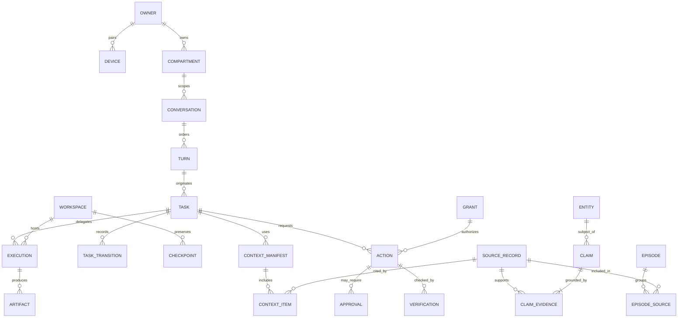

# Data and memory architecture

Status: proposed logical model. This is not a SQL migration or an instruction to build a generic memory framework.

## 1. Canonical state and derived state

| Data | Authority | Persistence and access |
| --- | --- | --- |
| Owner identity, explicit preferences, grants, task state | JARVIS PostgreSQL | Transactional, compartment-scoped access; versioned changes. |
| Conversations and source observations | JARVIS archive: metadata in PostgreSQL, large payloads in blob store | Raw committed turns retained subject to user deletion; provenance anchors. |
| Workflow history/timers | Temporal persistence | Separate DB roles; store opaque references rather than private transcripts. |
| Factual claims and episodes | JARVIS PostgreSQL | Evidence-backed, temporal, status-bearing; inferred is not confirmed. |
| Search vectors, lexical indexes, graph projections | Rebuildable projections | Same or stricter access scope as sources; never canonical authority. |
| Workspace files/profiles and native sessions | Execution storage with central manifests | Operational memory, distinct from factual memory; encrypted and retention-managed. |
| Action receipts, verification and approvals | JARVIS domain/audit records | Immutable application history with restricted mutation and explicit retention. |
| Credentials | Broker's OS-backed protected store | Database contains handles, scopes and expiry only. |
| Audio/video/screenshots | Short-lived media buffers or selected evidence | No ambient raw recording by default. |

Use PostgreSQL full-text search and pgvector alongside relational queries. A separate vector database and graph database are not baseline dependencies. Keep embedding model/dimension/version alongside each index generation; rebuild and switch generations explicitly. ACL filtering precedes content leaving storage and also applies during reranking. Approximate vector search needs filtered-recall evaluation; exact search over small compartments is a valid fallback. [PostgreSQL search](https://www.postgresql.org/docs/current/textsearch.html), [pgvector](https://github.com/pgvector/pgvector)

## 2. Logical entities and constraints

All owner-scoped entities carry owner_id and compartment_id where applicable. IDs are opaque; foreign keys enforce ownership-compatible relationships. Use typed columns for identity/status/time and JSON only for provider extensions or evidence payload metadata. Schema changes are versioned; archived payloads retain their schema identifiers.

| Entity | Important fields and constraints |
| --- | --- |
| Owner / Device | owner identity; device public credential reference, trust level, revoked_at, last_seen; no voice-biometric identity assumption |
| Compartment / Project | membership/policy, sensitivity, allowed destinations, retention; project may reference multiple compartments only through authorized links |
| Conversation / Turn | conversation_id, device_id, server_sequence UNIQUE per conversation, client_message_id UNIQUE per device, speaker, committed_at, interrupted, source artifact |
| SourceRecord | source/source_id/revision UNIQUE, observed_at, received_at, content_hash, artifact_id, compartment; late arrival is permitted |
| Task / TaskTransition | objective, criteria, revision, state, originating source, deadline, budget; transition UNIQUE(task_id, revision) |
| WorkflowBinding | task_id, engine, workflow_id, current_run_id, definition_version; engine's history is not duplicated here |
| Execution / ExecutionAttempt | task/workspace, adapter version, native session, context manifest, limits, lease_epoch, outcome; attempt has immutable start parameters |
| Workspace / Checkpoint | node/substrate/trust, generation, desired/observed status, image/volume refs; checkpoint has restore level and verified integrity |
| Artifact / ArtifactLink | digest, byte size, MIME, storage ref, retention, sensitivity, created_by; links name task/source/workspace and role |
| Entity / EntityAlias | person/org/place/project identifiers, source-scoped aliases; uncertain merges remain proposals |
| Claim | subject, predicate, typed value or object_entity, valid_from/to, recorded_at, superseded_at, status, confidence, source type |
| ClaimEvidence | claim_id, source_id, span/locator, extraction version, supporting/contradicting relation; every inferred claim requires evidence |
| Episode / EpisodeSource | summary version, temporal range, participant/project refs, source membership; reproducible provenance |
| Preference | explicit or inferred, scope, value, effective interval, evidence; cannot confer permissions |
| ContextManifest / ContextItem | retrieval purpose, policy revision, source versions, budget, destination; list exactly what was disclosed |
| Grant / Approval | workload/resource/verbs/expiry/revision; approval bound to immutable intent digest and one-time nonce |
| Action / ActionAttempt | intent digest, operation key UNIQUE per owner, target, grant, precondition, outcome; attempt recorded before submission |
| Verification | action/execution, criterion, verifier, evidence refs, result, freshness and limitations |
| IngressEvent / Outbox / Inbox | stable event ID, source cursor, consumer/event UNIQUE, dispatch state; invalid events quarantined |
| Subscription / Notification | mandate, source/filter, expiry/cost/quiet hours; notification dedup key and per-device delivery/read state |
| AuditEntry / DeletionRequest | actor, resource, decision/change, trace IDs; deletion scope, tombstone version and propagation status |

Conversation turns are immutable content revisions rather than overwritten strings. Corrections reference the original. The policy/identity profile is explicitly user-editable and versioned; background learning cannot silently rewrite system identity or authorization.

## 3. ER view

The diagram is a conceptual subset. Join tables are required for many-to-many artifact links, entity participation and evidence relationships; no single “memory” table is expected to contain every domain.

## 4. Temporal claims and uncertainty

Distinguish valid time (when a fact applied in the world) from recorded time (when JARVIS learned it). Intervals are half-open with optional unknown endpoints. A correction preserves the old assertion and records its supersession; it does not falsify the archive. “Worked at Acme until 2027” and “works at Example from 2027” are separate claims with evidence. Multiple employers may be valid: conflicts depend on predicate semantics, not a blanket one-value constraint.

Claim states: proposed, supported, disputed, superseded, retracted. User-confirmed evidence can have higher authority, but confidence numbers are not calibrated probabilities unless evaluated. Extraction must not invent precise dates from vague language. Current-world state additionally carries last_observed_at and stale_after; stale facts can support historical recall but not a fresh transaction.

Conversations include user statements, assistant hypotheses, imported content and tool observations as distinct source classes. An assistant repeating an unsupported assertion must not become independent confirming evidence. A document containing instructions remains source data, not user authorization.

## 5. Asynchronous memory processing

Archive a committed turn synchronously before acknowledging it. Schedule extraction asynchronously so memory bookkeeping does not delay voice. Pipeline stages: classify scope → propose claims/entities/episode → validate source spans/types → detect duplicates and contradictions → promote permitted claims → index. Each stage is idempotent on source revision, pipeline version and model version. Failed extraction is quarantined while raw recall remains available.

Use bounded structured-output extraction through existing model SDKs. Evaluate Graphiti as an optional temporal/entity projection and extraction provider; its documented temporal/provenance features align well, but adopting it does not remove JARVIS's authorization, deletion, or workspace responsibilities. Mem0 and Letta are alternatives evaluated in the research register; neither is selected as the owner of JARVIS state. [Graphiti](https://github.com/getzep/graphiti), [Mem0](https://github.com/mem0ai/mem0), [Letta](https://github.com/letta-ai/letta)

Consolidation is a budgeted workflow over candidate groups, not a nightly rewrite of the whole person. It may propose higher-level preferences and procedures with evidence links, preserve conflicting interpretations, and recompute stale summaries. Explicit user corrections override derived summaries. No autonomous promotion of credentials, policy rules, standing mandates or software/plugin installation instructions from memory.

## 6. Retrieval and context assembly

The recall module chooses from reviewed query strategies. The model may suggest intent/entities/time, but it does not submit arbitrary SQL. Parameterized queries, typed filters and server-resolved compartments form the boundary.

| Query | Retrieval plan |
| --- | --- |
| “John's number?” | Resolve person aliases in authorized contacts; exact typed claim; source/freshness; clarify ambiguous John. |
| “Strange restaurant in Tokyo?” | Temporal/location filters → lexical and embedding candidates from episodes/turns → rerank → cite source. |
| “Why did we change this config?” | Project/task lookup → decision and conversation evidence → authorized git/artifact references; distinguish inferred explanation. |
| “Continue the insurance thing” | Task/project resolution → active/paused state → workspace manifest and latest checkpoint → refreshed external state. |
| “Where did I work in 2025?” | Valid-time relational filter plus correction history; no current-state shortcut. |

Context assembly merges and deduplicates candidates, includes contradictory relevant evidence, ranks source quality and freshness, and selects within a fixed token/data-disclosure budget. Package identity instructions, user request, authorized facts, current task/workspace state, and clearly labelled untrusted source excerpts separately. Record the exact manifest and destination. Retrieved content never changes higher-trust policy.

If indexing lags, return raw/lexical records with an indexing watermark. If no evidence supports an answer, state the gap rather than fabricate a remembered fact. Measure retrieval on a curated owner-approved corpus, including ambiguous entities, corrections, deletion, and cross-compartment canary records. Useful metrics: evidence precision, temporal correctness, unsupported-answer rate, recall at budget and unauthorized disclosure count.

## 7. Operational memory, blob integrity and retention

Large files and snapshots are encrypted blobs referenced by IDs. Upload to staging, checksum, finalize atomically, then commit a database artifact reference; garbage-collect abandoned staging objects after a grace period. Backups capture referenced blobs before dependent metadata is considered recoverable. A missing blob makes its artifact unavailable, not silently empty. Content hashes aid integrity/deduplication but do not replace authorization; avoid cross-owner deduplication side channels.

Raw user/assistant turns are archived by default; private mode can opt out of persistent content while retaining minimal delivery metadata. This intentionally qualifies the brief's “all conversations”: users must be able to delete or exclude private data. Raw ambient audio is not retained by default; screenshots and traces have shorter configurable retention than selected artifacts. Workspace browser profiles and VM memory contain credentials and require secret-equivalent handling.

Deletion creates an immediate retrieval tombstone, cancels pending extraction, removes affected claims/index entries/context caches and propagates to optional projections, blobs and workspace checkpoints. Regenerated summaries must exclude deleted sources. Already-exported data or third-party provider retention cannot be assumed retractable. Restores replay the deletion ledger before serving recall; backups expire on a declared schedule. If retaining a minimal audit entry is necessary, preserve only non-content metadata under the declared retention policy.

Do not treat vector deletion alone as forgetting. Source text, derived summaries, snapshots, logs, exported contexts and backups are all part of the data lifecycle.
