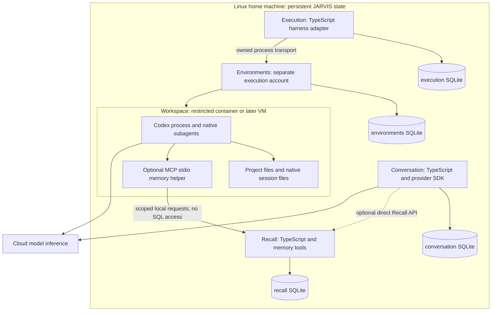
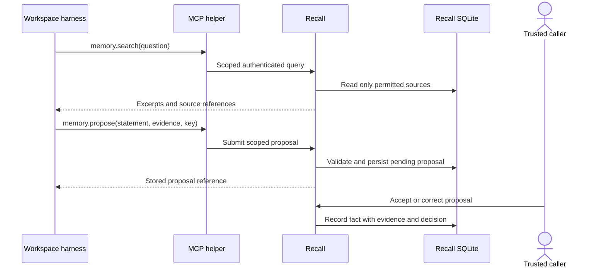

# Four modules: internals, stack and runtime

Design detail requested 2026-09-07. **Proposed default for implementation review, not implementation authorization.** This adds concrete choices to iteration 2 without adding a fifth product module or requiring all four to run together.

**Scope clarification after the OS-1 discussion:** this stack locates storage and harnesses; it does not yet establish live host/mail/calendar access or reliable conversational reference resolution. The [shared-context design](../product/shared-context-and-presence.md) adds the missing responsibilities. The text-first module test below qualifies persistence/provider integration; voice and shared attention need an early product test of their own.

## 1. Shared engineering choices

| Concern | Proposed default | Reason and limit |
| --- | --- | --- |
| Language/runtime | TypeScript, strict mode; Node.js 24 LTS | One language for module contracts, harness adapters and model SDKs. Current primary release documentation lists Node 24 as LTS. |
| Local persistence | SQLite through `better-sqlite3`; one database per module | No database daemon; real transactions and module-owned migrations. No cross-module SQL. |
| Input validation | Zod | Validate module inputs and untrusted provider/tool output at boundaries. |
| Public/local transport when needed | Fastify; HTTP over a Unix socket for local interprocess calls | Module libraries/direct calls need no server. Fastify is an optional hosting adapter, not a dependency of domain logic. |
| Agent memory tools | Official TypeScript MCP SDK, stdio transport | Reuse MCP transport; implement only JARVIS's scoped memory operations. |
| Evaluation | Vitest, temporary database files, recorded provider fixtures; separate live adapter tests | Every module has independent tests and a manual entry point. Fixtures do not prove real integration. |
| Packaging | npm workspaces, module-local dependencies | One repository, four independently runnable packages; no container or DB services needed just to import a module. |

These are proposed dependencies, not installed packages. Pin compatible stable versions when implementation starts; verify SQLite FTS5 availability and native-addon support in that exact build. [Node releases](https://nodejs.org/en/about/previous-releases), [better-sqlite3](https://github.com/WiseLibs/better-sqlite3), [Zod](https://zod.dev/), [Fastify](https://fastify.dev/docs/latest/), [MCP SDKs](https://modelcontextprotocol.io/docs/sdk), [Vitest](https://vitest.dev/guide/)

Choose SQLite for the initial single-machine, low-write-concurrency deployment. Use WAL on local disk, short transactions, foreign keys and bounded busy handling. One owning module process writes each file. Background import/search work must not block conversational streaming; use a worker thread for expensive Recall work when enabled. WAL is not a shared-network-filesystem solution. More concurrent writers or multi-machine database access would justify evaluating PostgreSQL, not synchronizing SQLite files. [SQLite suitability](https://sqlite.org/whentouse.html), [WAL](https://www.sqlite.org/wal.html)

## 2. Execution internals

| Subcomponent | Responsibility | Stack / classification |
| --- | --- | --- |
| Request gate | Validate objective, descriptor, permitted operations, timeout and output expectations | TypeScript + Zod; BUILD small boundary |
| Harness adapter | Start/observe/steer/cancel using native semantics; retain native IDs | Codex App Server over stdio; INTEGRATE native harness, BUILD thin translation |
| Transport connection | Connect the adapter to a process in a supplied environment | Prepared stdio transport; Environments supplies the real process transport when composed |
| Execution recorder | Store request, meaningful lifecycle events, native session reference and outcome | SQLite + `better-sqlite3`; BUILD domain records, INTEGRATE storage |
| Result collector | Collect allowed output paths, preserve selected artifacts, distinguish reported from checked results | Existing filesystem APIs and manifest; BUILD glue |

**First provider:** Codex App Server because lifecycle/approvals are part of the requested execution boundary. Use its documented local stdio interface; do not depend on experimental TCP WebSocket transport. Generate/use schemas from the selected Codex version when building. `codex exec` remains a simpler alternative for a strictly batch-only caller, not a second mandatory adapter. [Codex App Server](https://learn.chatgpt.com/docs/app-server), [batch mode](https://learn.chatgpt.com/docs/non-interactive-mode)

The TypeScript adapter lives in trusted host-side JARVIS. The Codex process lives inside the workspace, next to the files it can operate on. Native subagents, tool calls and compaction belong to Codex. JARVIS does not implement them. On completion the adapter persists the result; the provider process can stop without losing the JARVIS execution record.

Store proposed tables `executions`, `observations`, `artifacts` and `native_sessions`. Do not store every token as a database event. Capture status changes and selected diagnostics; stream transient output to the caller. Native session files stay in a dedicated workspace provider directory, not the owner's real Codex home. An interrupted process may yield `unknown`; automatic restoration is not assumed.

**Standalone:** a manually prepared isolated container/process connection substitutes for Environments. A deterministic transport fixture tests lifecycle mapping without a model account. The live test still runs the actual harness under real restrictions.

## 3. Environments internals

| Subcomponent | Responsibility | Stack / classification |
| --- | --- | --- |
| Profile validation | Accept bounded compute resources, explicit imports and required isolation | TypeScript + Zod; BUILD |
| Backend adapter | Create/start/inspect/stop/remove owned environment | Rootless Podman CLI first; INTEGRATE, invoked with argument arrays, never concatenated shell commands |
| Access/export adapter | Return a stdio process connection, import files and export allowed artifacts | Podman exec/copy facilities; BUILD narrow mapping |
| Resource registry | Track owned IDs, profile, observed state and cleanup outcome | Separate SQLite file; BUILD records |

**First backend:** rootless Podman on a Linux execution host, under a dedicated `jarvis-exec` OS account. Use a pinned Linux image containing the chosen harness and ordinary task tools. No host home, JARVIS state directories, runtime socket or personal SSH agent is mounted into the container. This is for bounded compute, not a claim of strong isolation against arbitrary hostile software. [Podman](https://docs.podman.io/en/latest/markdown/podman.1.html), [process execution](https://docs.podman.io/en/latest/markdown/podman-exec.1.html)

The environment host exposes only owned-resource operations to trusted Execution, with local peer/account checks. It owns its Podman runtime access. The agent receives neither the Podman socket nor this control endpoint. A manually created environment can provide the same transport without the Environments package running.

**When a GUI or stronger isolation is required:** add a libvirt/KVM backend, not a new workspace system. Native browser/computer-use tools run in that guest. Guest image and viewer remain undecided until a real GUI exercise. A container profile is not silently upgraded into a claimed safe hostile-code sandbox. [libvirt](https://libvirt.org/manpages/virsh.html)

Store `workspaces`, `imports`, `exports` and `backend_resources`. Workspace file contents remain in runtime-managed volumes; metadata does not duplicate the entire filesystem. `stop` preserves data when requested; `release` removes only owned resources after outputs are handled. No general snapshot support is promised by the first backend.

**Host assumption:** the repository is currently on Windows. This design proposes Linux/Omarchy as the first execution target; no such machine has been inspected. If development stays on Windows, qualify a Linux VM first or revise the backend. Do not claim native Windows Podman behavior is interchangeable without testing.

## 4. Recall internals

| Subcomponent | Responsibility | Stack / classification |
| --- | --- | --- |
| Source ingestion | Accept records with identity/revision/scope; deduplicate and chunk for retrieval | TypeScript; BUILD source policy |
| Source store | Preserve source text, locators, revisions, deletion state and provenance | SQLite; INTEGRATE |
| Retrieval | Scope filtering, exact/temporal queries, lexical search and bounded result selection | SQLite tables + FTS5/BM25; INTEGRATE search, BUILD query policy |
| Memory proposal handling | Store agent-suggested facts/notes separately from confirmed knowledge | TypeScript validation + SQLite transactions; BUILD |
| Agent access adapter | Expose scoped read/proposal tools without exposing SQL | Official MCP TypeScript SDK + stdio helper; BUILD three tool mappings |

**Initial search stack:** SQLite FTS5 for source text plus ordinary relational fields for explicit facts, source type and time. This is a concrete baseline, not a claim that lexical search fulfills the eventual fuzzy-memory vision. First measure retrieval on the fixture corpus. Semantic embeddings and a vector extension/service are an explicitly optional second retrieval path; no embedding model, graph database or vector engine is required for the first module. [FTS5](https://www.sqlite.org/fts5.html)

Store `sources`, `source_chunks`, `source_fts`, `memory_proposals`, `facts`, `fact_evidence`, `access_scopes` and `ingestion_receipts`. These are proposed logical tables, not migrations. Indexes are derived; accepted facts retain source references. Exact fields evolve from tested queries instead of reproducing iteration 1's entire memory schema.

No always-running “memory agent” is needed. Source ingestion and indexing are ordinary application work. Model-assisted extraction, if later useful, makes a bounded model call from Recall and produces the same validated proposals. No generic agent loop is added. Existing Graphiti/Mem0 capabilities remain candidates if they reduce actual extraction/retrieval work; choosing SQLite does not require recreating those products.

**Standalone:** ingest synthetic JSON/text records, query them, correct/delete a source and inspect results. MCP is optional: the same module API can be called directly. Neither Execution nor Conversation needs to be present.

## 5. Conversation internals

| Subcomponent | Responsibility | Stack / classification |
| --- | --- | --- |
| Turn handler | Validate incoming turn, persist it and serialize replies within a conversation | TypeScript + Zod; BUILD |
| History/identity store | Canonical turns, interrupted output markers, explicit identity instructions | SQLite; BUILD domain data, INTEGRATE store |
| Context assembly and reference resolution | Combine recent history, explicitly shared current-source observations and optional Recall results; resolve ambiguous references or ask | TypeScript and existing model inference; BUILD bounded composition, no mandatory Recall dependency |
| Provider adapter | Send request, stream answer, report provider failures/cancellation | Official OpenAI TypeScript SDK, Responses API first; INTEGRATE |
| Source export | Supply committed turn revisions and removals for optional Recall ingestion | Direct export API; BUILD small mapping |

Proposed first text model is `gpt-6-astra`, configurable rather than embedded in domain contracts, subject to account access and cost evaluation. The current official model page documents it; this does not establish the user's API entitlement. No silent switch to a different provider or data destination. [API quickstart](https://developers.openai.com/api/docs/quickstart), [Astra model](https://developers.openai.com/api/docs/models/gpt-6-astra)

The conversational model's inference runs at the selected provider; there is no permanent model process living in the conversation database. JARVIS owns the turns and rebuilds context for continuation. Native provider response/session IDs are optional references. First implement ordinary text conversation without a tool loop. Delegated actions later go to Execution, which already integrates a harness.

Current context needs the shared object's source ID, observation time and active topic, not just text that sounds relevant. Persist useful source associations in Recall when enabled; invalidate current-attention claims on a context change. A source reader must actually supply a calendar event or current message before the model can answer “next call” or “did they reply?”. Those connectors remain unimplemented and their exact integrations are not selected here.

Store `conversations`, `turns`, `identity_profiles`, `provider_references` and, when live Recall export is connected, `source_changes`. No provider credentials belong in these tables. Identity instructions are explicit configuration; inferred preferences cannot overwrite them.

**Standalone:** direct text caller plus local history file/database. A provider fixture exercises storage and restart; a real provider test establishes streaming/cancellation behavior. Recall being offline must not prevent ordinary conversation.

## 6. Where the databases and agents physically live

Proposed first composed deployment: one Linux machine, two OS trust identities. A trusted JARVIS host process can enable Execution, Recall and Conversation modules independently. Environments runs under `jarvis-exec`, independently of that host, because it controls execution resources. This is a hosting choice; each module also has a standalone caller mode. An execution supervisor is not a fifth product module: it is the Environments hosting adapter.

| Path on the proposed runtime host | Owner / purpose |
| --- | --- |
| `/var/lib/jarvis/execution/state.sqlite` | Execution records |
| `/var/lib/jarvis/recall/state.sqlite` | Sources, retrieval index and memory proposals/facts |
| `/var/lib/jarvis/conversation/state.sqlite` | Canonical turns and identity profile |
| `/var/lib/jarvis/artifacts/` | Selected exported reports/files; database stores references |
| `/var/lib/jarvis-exec/environments/state.sqlite` | Environments registry, owned by execution service account |
| Runtime-managed volumes under `jarvis-exec` storage | Workspace projects, temporary files and dedicated native harness sessions |

All paths are design targets, **not files created in this task**. Standalone development supplies a temporary/module-local state directory instead. Only the invoked module opens/creates its own database. No SQLite file is mounted into an agent container. The three trusted modules sharing a host process are a code ownership boundary, not mutual protection from compromised host code; agent isolation is the enforced OS/container boundary.

The process can outlive a UI using ordinary systemd services when deployed. Shutdown of a harness or container leaves JARVIS's databases intact. Loss of the host disk still requires backups; local persistence is not high availability.

## 7. Agent memory read path

Execution can supply a fixed context bundle without any live Recall connection. When live memory is enabled, provide three MCP tools: `memory.search`, `memory.read`, and `memory.propose`. Tool names here describe the planned contract, not code already registered.

1. A trusted caller enables Recall access for the execution and specifies readable source/project scopes, proposal scope, expiry and result-size limits. Recall records this as a narrow access scope; no global permission platform is required.
2. Execution configures the harness with the official-SDK stdio helper inside the workspace. It forwards only these operations to Recall's dedicated local HTTP-over-Unix-socket endpoint. That socket exposes no module administration or other JARVIS API. The host path to SQLite is never shared.
3. The helper uses an opaque, short-lived per-run token. The token can be accessible to the harness process; its limited authority, expiry and Recall-side checks are the boundary. It is not a database credential or a general API key.
4. Recall resolves allowed sources from the token, not from model-supplied owner/scope fields. It checks permission again on every `read`, including guessed source IDs, and before returning query results.
5. The agent gets compact excerpts with source IDs/revisions and uncertainty. It receives neither all personal memory nor the raw index. Returned private data may reach that harness's model provider, so the scope must also permit that destination.

The Unix-socket mount must be qualified on the chosen container setup; it conveys access to the restricted Recall listener only, not filesystem browsing. If this integration is unavailable, use an explicit preassembled context bundle. Do not expose an unauthenticated host-wide TCP endpoint as a fallback. A future remote node needs a separately designed authenticated network transport.

## 8. Agent memory write path

**Automatic archive and inferred memory are different writes.** Conversation saves its own raw turns regardless of whether Recall runs. When connected, source exports are ingested by Recall as source material. An agent suggestion is archived as an agent suggestion, not automatically accepted as truth.

`memory.propose` accepts a proposed statement/note, source IDs or an allowed artifact reference, and an idempotency key. Recall stamps execution identity from its access scope, validates evidence access, and inserts a pending proposal transactionally. The response means “proposal stored,” not “fact confirmed.” The agent cannot select its own trust level, change identity instructions, erase sources or issue arbitrary SQL.

For example: after analyzing a project, Codex may propose “This project requires Node 24,” citing its inspected package file and execution report. Recall saves that proposal and provenance. A human can accept/correct it through the trusted local module API in the first implementation. Routine later automation may promote specific source-backed categories after evaluation; it is not needed to complete the write path. Explicit user instructions such as “remember this preference” can use the trusted caller's authorized write operation and preserve the originating turn.

A write with a lost acknowledgement is retried with the same key. A corrected fact preserves its source/history and supersedes the prior interpretation. A run without Recall access can return proposed notes as an output artifact for later import; it must not claim they have already entered memory.

## 9. Persistence when modules are connected

Conversation's `source_changes` records are committed with their turn changes only when the export integration is enabled. A simple composition worker exports pending revisions and removals to Recall; an ingestion receipt allows the same change to be retried safely. It can run on demand and at host startup; no queue service or durable workflow engine is needed. Recall being down leaves the change pending and conversation usable. This narrowly implements source delivery, not a general event platform.

For a requested source deletion, block live Recall use for the affected scope until it acknowledges the removal; otherwise a stale copy could still disclose deleted data. In the first local deployment, conservative whole-scope blocking is acceptable. Standalone static corpora use explicit import/remove and are labelled snapshots. Artifact imports follow the same source/revision contract.

Back up each database using SQLite's supported backup API, along with referenced selected artifacts. Do not copy a live main file while ignoring its WAL. For the simple composed backup, pause source transfer/writes, capture the module databases and artifact manifest, then resume. Restore in a non-serving state and reconcile source removals before reopening Recall. Choose encryption through host storage and encrypted backups before using private data; SQLite does not imply encryption. [Backup API](https://www.sqlite.org/backup.html)

## 10. What remains replaceable

These defaults answer how we could build the four modules now. They do not commit us to all future features. A harness adapter can change without moving conversation history; a search implementation can change without giving agents database access; an environment backend can change while keeping its descriptor contract. PostgreSQL becomes a migration decision if write concurrency or remote storage access warrants it. GUI images, semantic retrieval, voice, home connectors and durable automation remain separate extensions of these boundaries, not new prerequisites.
