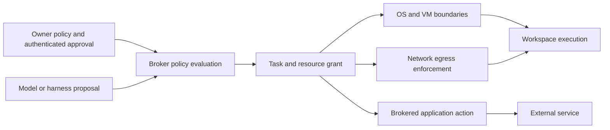

# Security, recovery, and operations

Status: proposed. These are product boundaries to implement and test later, not claims that this repository currently enforces them.

## 1. Authority model

Trust the owner, the authenticated approval channel, reviewed core/broker code, and the underlying OS/hypervisor. Treat model outputs, repository instructions, web pages, emails, MCP responses, imported files, and workspace software as untrusted. A remote device has only its paired role; possession of a conversation ID provides no access.

The broker's decision is the intersection of owner policy, task mandate, resource grant, workload identity, current lease, destination/data constraints, and remaining budget. An inferred preference is never authority. Model risk classification may increase scrutiny but cannot relax deterministic restrictions.

| Authority class | Example | Proposed handling |
| --- | --- | --- |
| Bounded read | Read imported project or authorized memory | Standing scope; no repeated prompt. |
| Reversible workspace write | Edit isolated repo, create local artifact | Task authorization within quota and workspace boundary. |
| External mutation | Create calendar event or send message | Exact standing mandate or concrete action approval; receipt and readback. |
| High-impact operation | Spend money, unlock entry, delete important external data, change credentials | Narrow authorization, fresh intent/preconditions, trusted approval when not already explicitly scoped; no generic “allow all future actions.” |
| Host administration | Change service/configuration | Reviewed typed operation or time-bounded explicit session; path/service and rollback plan. |

Persistent authorizations avoid confirmation fatigue; expired, changed-target or out-of-scope requests do not inherit them. Approval UI shows actual account, target, parameters, impact and expiry. Bind the response to that immutable intent digest and one-time nonce. A changed price, recipient or file set invalidates the old approval.

## 2. Where enforcement happens

Harness tool permissions are defense in depth. Shell access can otherwise bypass MCP restrictions through HTTP clients, subprocesses, files or installed credentials. Enforce read/write mounts, process identity, network reachability and credential access outside the harness. Do not expose host home, agent credential homes, Docker/Podman sockets, libvirt sockets, SSH agents, cloud metadata or user D-Bus to general workspaces.

Separate service accounts for core, broker and execution. Core has no arbitrary sudo and no hypervisor socket. A narrow supervisor/privileged helper uses existing libvirt/systemd operations against owned resources; it rejects caller-supplied shell strings and unmanaged resource IDs. The execution account cannot modify supervisor configuration or policy. Enforce cgroup CPU/RAM/PID and disk limits. OS compromise or a malicious root administrator remains outside the isolation guarantee.

Egress restrictions must apply below the agent: deny direct LAN/metadata/private service access and uncontrolled DNS/UDP bypass, and allow only required destinations through reviewed network policy. Redirects and DNS rebinding need destination revalidation. An allowlisted domain can still receive exfiltrated data, so data minimization and application-scoped brokerage remain necessary. No claim that a hostname allowlist prevents all leakage.

## 3. Credential brokerage and authenticated GUI limit

Use systemd credential facilities for local service secret delivery rather than custom encryption. Refresh tokens remain in broker-only protected storage; rotate provider credentials and expose only narrow short-lived tokens when the upstream service supports them. Prefer a broker that executes the action without handing the upstream token to an agent. OpenBao is an optional upgrade for multi-node dynamic secret needs, not a prerequisite daemon. [systemd credentials](https://systemd.io/CREDENTIALS/), [OpenBao](https://openbao.org/docs/what-is-openbao/)

Some harnesses require provider credentials or their own supported login. Treat those as real secrets available to the harness process, with dedicated storage, constrained account/budget and no model-facing inclusion. Do not pretend environment injection makes a credential unreadable to a process with shell access. Do not copy desktop subscription cookies into remote workspaces or assume third-party unattended use is entitled; validate supported authentication for each pinned adapter.

An authenticated browser may have broad account authority. “Read-only browser” is not an enforceable permission merely because a prompt says so. For accounts with impactful actions, prefer read-scoped APIs, separate limited accounts, or human-controlled completion. Unattended high-impact GUI operation is disabled unless the selected provider and transport can enforce the exact permitted action. A driver with arbitrary clicks is not that enforcement mechanism. This is a deliberate reduction in autonomy, not a deferred prompt-engineering task.

On human handoff, revoke agent input and shell/CDP routes that could still drive that browser. If such revocation cannot be verified, use a separate human environment. Screenshots, clipboard, browser profiles and RAM snapshots can contain credentials; give them secret-level retention and encryption. A snapshot restore always rechecks grants and revocation epoch outside the restored guest.

## 4. Plugins, MCP, and malicious context

Use maintained MCP implementations for tools, not a custom JSON-RPC stack. Tool annotations and descriptions are advisory. Validate remote authentication, token audience, redirect behavior, request origin and destination. No token passthrough or arbitrary server installation based on a retrieved instruction. Pin and review plugin/skill versions; run third-party tool servers in constrained processes. MCP is a capability transport, not the cross-device authorization model. [MCP security practices](https://modelcontextprotocol.io/docs/2025-11-25/tutorials/security/security_best_practices)

Prompt-injection resistance comes from limited reach: a malicious page cannot grant itself a filesystem mount, change the memory ACL, approve an action or reach the broker control API. Label retrieved content as evidence; keep policy outside editable workspaces. Do not render raw tool HTML/scripts in approval or artifact surfaces. Quarantine active downloaded content and preview with established safe viewers. Trusted UI must not accept “user approved” text from a harness as an approval record.

## 5. Failure and recovery matrix

| Failure | Detection | Recovery | Forbidden shortcut |
| --- | --- | --- | --- |
| Client closes | Device heartbeat disconnect | Keep backend work; replay changes on reconnect | Tie task lifetime to browser socket. |
| Model timeout/rate limit | Typed provider error and deadline | Bounded retry/circuit breaker, compatible fallback or wait | Cross privacy boundary silently. |
| Harness exits | Supervisor observes owned unit exit | Persist partial artifacts; inspect, reconcile, then resume/new attempt | Interpret exit zero as verified completion. |
| Workflow worker crashes | Temporal worker/task timeout | Native workflow replay; activities inspect receipts | Replay a purchase blindly. |
| Node disappears | Heartbeat and lease expiry | Stop new actions, reconcile owned resources, require safe failover | Run a second writer because a ping failed. |
| External action result lost | Missing receipt after submitted intent | Provider lookup; otherwise unknown/needs attention | Infer failure from timeout. |
| Workspace corrupt | Health and checksum failure | Quarantine; restore a verified checkpoint or files | Resume credentials and network immediately. |
| Duplicate/out-of-order event | Inbox key and source revision | Dedup or source-aware merge; resync after gap | Global last-arrival-wins. |
| Database unavailable | Health/write failure | Reject durable acceptance; clients may queue unsent input | Acknowledge persistence without commit. |
| Temporal unavailable | Start/signal failure, growing outbox | Retain pending dispatch; interactive archive/recall may remain usable | Run ad-hoc fallback jobs outside workflow control. |
| Disk full | Thresholds and write errors | Stop admission; preserve receipts; purge only eligible derived data | Delete canonical records to keep agents running. |
| Conflicting/stale memory | Provenance/validity checks | Return conflict/freshness; reconcile in background | Overwrite history with newest model guess. |
| Provider/tool schema changed | Negotiation/contract validation | Disable affected adapter, retain data, roll back version | Guess undocumented compatibility. |
| Credential revoked | Auth failure or owner revoke | Close grant; pause for supported reauthentication | Reuse old snapshot token. |
| Broker unavailable | Health failure | Deny new external mutations; preserve local bounded work until expiry | Let agent call upstream directly. |
| Audit persistence unavailable | Transaction/append failure | Fail closed for consequential mutations | Execute first and promise to log later. |

## 6. Observability and verification

Use OpenTelemetry instrumentation and Collector; export to a selected metrics/trace backend rather than building one. Start operational logs in journald with structured fields. Full Grafana/Prometheus/trace-stack deployment is optional until the operating footprint warrants it. [OpenTelemetry Collector](https://opentelemetry.io/docs/collector/)

Carry owner-safe correlation IDs across task, workflow, execution, workspace, action, context manifest, memory job and verification. Record provider/model/version, prompt-template version, short routing rationale, grant decision, source IDs, usage/cost where available, artifacts and observed outcomes. Do not request or store hidden chain-of-thought. Native logs may contain private text: redaction and retention apply before telemetry export.

Audit records are separate from sampled diagnostic traces. Do not sample away approvals, revocations, external mutation intents/results or policy changes. Append-only database permissions reduce accidental modification; they are not tamper-proof against the host administrator. Stronger remote immutable audit storage is optional if the threat model changes.

Operational dashboards: task states and wait reasons, workflow/outbox age, execution leases, broker denies, unknown outcomes, curation/index lag, provider circuit status, budget reservations, disk/snapshot usage, backup freshness and restore results. Notification delivery and acknowledgement are distinct. Availability notices should explain what remains usable.

## 7. Proposed service and resource targets

These are design targets for a defined reference machine, not benchmarks or promises. Establish the machine and workload before accepting them.

| Target | Initial acceptance budget |
| --- | --- |
| Durable command acknowledgement | p95 under 500 ms on local network, excluding inference. |
| Authorized memory recall | p95 under 1 s on agreed representative corpus. |
| Voice playback interruption | Local stop under 200 ms; independent of cloud round trip. |
| Useful first voice response | p95 under 2 s under supported network/model conditions; report measured failure rate. |
| Background memory freshness | 95% of normal committed turns processed within 60 s; raw fallback available. |
| Node lease | Initial 30 s validity, renew at 10 s; broker checks every action; tune with partition tests. |
| Restart recovery | Control services recover within 2 min after storage/key availability. |
| Crash data loss | No acknowledged domain-write loss while durable storage remains intact. |
| Disaster recovery | Proposed RPO 24 h / RTO 4 h for single-node backup profile; explicitly weaker than local crash recovery. |

Initial admission policy: one delegated GUI workspace, at most two compute executions, one curation worker, and a reserved interactive lane. These are configurable caps, not claims about hardware sufficiency. Estimate baseline home-node budget at 4 CPU cores, 8 GB RAM excluding VMs/models; provision extra measured RAM per guest, with 32 GB total as a planning assumption for mixed desktop use. Avoid GPU requirements for the core. Local inference and sustained media capture need separate capacity validation.

Storage estimation must include retained input/output bytes, daily artifacts, VM image deltas and backup copies. Snapshot quotas are per workspace plus global reserve. Reserve provider budget before starting; missing usage reporting uses a conservative maximum rather than zero. Budget exhaustion pauses at a safe boundary; already submitted provider work may incur additional charges, so hard financial limits also require provider-side controls.

## 8. Backup, upgrade and incident procedure

Use supported PostgreSQL backups and a mature encrypted backup tool such as restic for selected blobs/manifests. Do not live-copy database files as a backup strategy. Temporal persistence and JARVIS data both require restore plans; a backup of only one is insufficient. [restic references](https://restic.readthedocs.io/en/stable/100_references.html)

For the initial coordinated backup: stop new admission, drain or pause workflows at safe boundaries, settle database/outbox writes, capture the required databases and referenced artifacts, and write a backup manifest with versions and deletion-ledger position. Do not keep the system offline for a full VM upload: finalize a consistent selected checkpoint set, then transfer immutable data. Keep recovery keys outside the failed machine. More demanding RPOs require continuous database backup and a revised cross-store restore design.

Restore into isolated networking. Verify integrity, restore stores and compatible workflow definitions, apply deletion/revocation ledgers, increment the authority epoch, invalidate outstanding grants, reconcile external actions and node receipts, then reopen admission. Old external actions must not execute because a restored outbox is stale. Run a restore rehearsal before entrusting important data.

Upgrades pin component versions and image digests. Drain affected executions, preserve compatible old workers for in-flight workflow history, migrate data using tested forward/backward windows, and canary adapter conformance before enabling. A database schema downgrade may require a restore and reconciliation rather than a binary rollback.

Incident kill switch revokes external grants, cuts workspace egress/input and stops admissions independently of model cooperation. Preserve necessary evidence under retention policy, isolate affected nodes, rotate compromised credentials, and resume only after integrity and action reconciliation. An offline node's already issued external bearer token may remain usable until revoked upstream or expired; design short lifetimes and avoid issuing such tokens where immediate revocation is required.
