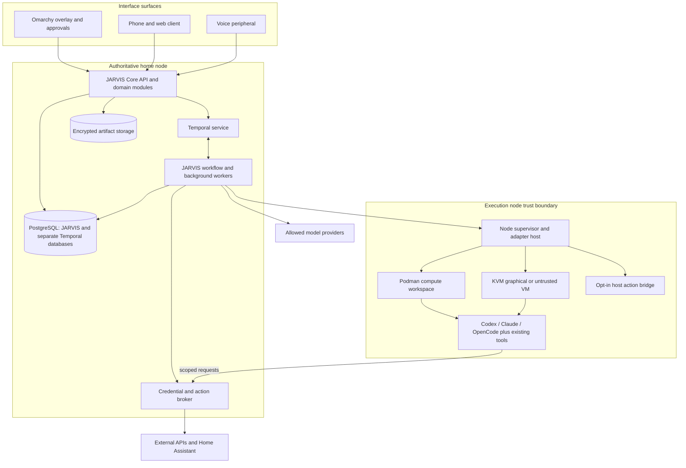

# System architecture

Status: proposed, 2026-09-07. Evidence and alternatives: [research](research.md), [ADRs](decisions.md).

## 1. Requirements and invariants

JARVIS is a personal runtime with persistent identity and useful continuity across interfaces. “One intelligence” means consistent identity, shared durable context, and coordinated authority; it does not require one immortal model process or a single reasoning stream.

| ID | Requirement | Architectural consequence |
| --- | --- | --- |
| R01 | Clients and inference sessions may terminate independently | State and job ownership belong to a backend. |
| R02 | Tasks may last months with no model running | Durable schedules, waits, explicit cancellation and expiry. |
| R03 | Delegated work does not occupy the user's desktop | Separate compute and graphical execution environments. |
| R04 | Multiple replaceable harnesses | Small lifecycle contract plus namespaced provider extensions. |
| R05 | Conversations remain recoverable; recall is selective | Canonical archive, provenance, structured and hybrid retrieval. |
| R06 | Cognitive and operational memory cooperate | Link claims, tasks, artifacts, sessions, workspace checkpoints. |
| R07 | Proactivity is authorized and quiet by default | Explicit subscriptions, deterministic filtering, notification policy. |
| R08 | Powerful agents receive limited authority | External resource enforcement, expiring grants, isolated nodes. |
| R09 | Completion is based on evidence | Verification contracts and an explicit unknown-outcome state. |
| R10 | Voice, desktop, phone, and home share continuity | Backend conversation IDs; surface leases; independent media sessions. |
| R11 | Local and cloud outages degrade predictably | Local storage/control; no silent privacy downgrade on fallback. |
| R12 | Existing infrastructure is reused | Custom code handles product semantics and integration only. |
| R13 | Multiple devices do not create conflicting executors | Single authoritative control plane, fenced execution leases. |
| R14 | Extension must preserve trust boundaries | Reviewed capability declarations and constrained plugin processes. |

Scope assumptions: one owner, personal rather than enterprise multi-tenancy, Linux execution nodes initially, optional paid cloud inference. Guests and shared rooms are separate low-trust principals; no automatic access to the owner's memory. No hard realtime robotics, life-safety control, guaranteed universal GUI automation, or offline frontier-quality cognition.

## 2. Architecture and process boundaries

These are trust/process boundaries, not a mandate for a microservice per box. The first deployment has a core application, a worker process from the same codebase, a node supervisor, and a separately privileged broker. Temporal and PostgreSQL are integrated infrastructure. Artifact storage starts as a managed encrypted filesystem with a blob API. Model adapters and connectors are modules or restricted child processes, not independently deployed services by default.

Proposed application language: TypeScript for core, Temporal workers, and harness adapters; Python only where an integrated perception/browser library requires it, behind a process boundary. Use mature HTTP, validation, database, and SDK libraries rather than implementing transport or serialization. Native desktop UI uses Omarchy's QML/Quickshell mechanism. No shared-memory assumptions across these boundaries. Language choice is revisitable before implementation; neither low-level VM management nor a new privileged shell runtime is justified.

## 3. Responsibilities and ownership

| Component | Classification | Owns | Must not own / why custom work is justified |
| --- | --- | --- | --- |
| Core domain modules | BUILD | Identity profile, conversations, tasks, project associations, API authorization | No code-editing/tool loop. Existing harness sessions cannot be the cross-provider system of record. |
| Context and recall module | BUILD + INTEGRATE search | Authorized context packages, query selection, evidence and token budgets | No database/search engine. Product-specific compartment and provenance rules require composition. |
| Workflow definitions | BUILD on INTEGRATE Temporal | Task transitions, approval waits, monitoring policies, reconciliation choices | No scheduler/replay engine. Task semantics differ from generic infrastructure. |
| Policy and resource broker | BUILD on OS/credential libraries | Grants, mediated external actions, import/export and audit | No cryptography, OAuth implementation, VM engine, or arbitrary privileged command API. Cross-harness authority is the gap. |
| Execution node supervisor | BUILD thin integration | Resource inventory, leases, adapter lifecycle, recovery receipts | No terminal emulator or general agent loop; integrates systemd, Podman and libvirt. |
| Harness adapters | BUILD thin integration | Capability negotiation, status mapping, native session references | Harness retains planning, tool calls, compaction, code edits and native subagents. |
| Memory curation policies | BUILD + OPTIONAL extraction library | Validation/promotion, contradiction policy, provenance, deletion | No new embedding or knowledge-graph engine. Canonical governance remains JARVIS-specific. |
| Surface coordination | BUILD + INTEGRATE platform UI/media | Active turn/audio ownership, notifications, approvals and handoff | No custom audio codec, remote desktop protocol, or complete chat platform. |
| Connectors | INTEGRATE; thin mapping when needed | Source cursors, schema mapping, health, service-specific verification | Use maintained APIs/MCP/CLIs. Home Assistant owns device protocols and home automations. |
| Database, workflow, telemetry, secrets, virtualization | INTEGRATE | Their native infrastructure responsibilities | Do not wrap their complete APIs or write replacement engines. |

## 4. Omarchy integration

Use Omarchy as the preferred first **desktop target**, not as a required core operating system. The release endpoint resolved to v4.0.2 during research; the rolling manual may describe newer branch behavior. Record the actual target release, package versions, and adapter capabilities before claiming support. [Release evidence](https://github.com/omacom/omarchy/releases/tag/v4.0.2)

Reuse mise-managed agent installation, default-agent preference, native skill locations, and usage UI. Preserve the user's default; it is a routing preference after permission/capability checks. Treat usage-panel totals as advisory, not an admission-control ledger. Keep tmux for optional human inspection, never as job durability. Crash diagnosis becomes an opt-in observation-to-task integration, with one notification owner. Omarchy's prompt/terminal shortcuts auto-approve work, so managed jobs call pinned native harness interfaces with explicit settings instead. [AI integration](https://omarchy.org/manual/ai/)

A small shell plugin supplies status, summon, job/workspace links and ordinary approvals. Omarchy's plugins run unsandboxed inside its shell process; no core database credentials or general broker authority belong there. High-impact approval can require a paired phone/passkey surface outside an agent-controlled desktop. Use third-party plugin locations rather than editing first-party files. [Plugin model](https://omarchy.org/manual/shell-plugins/)

On a single PC, core services run under dedicated system accounts and survive desktop logout. On an always-on home server, use a stable Linux distribution and retain Omarchy as a peripheral/execution node. Installation reuse on Omarchy does not mean auto-upgrading production agents during live jobs: resolve approved versions into execution images, drain before updates, and retain rollback versions.

## 5. Harness and model orchestration

Integrate Codex App Server over local stdio for interactive tasks, streamed lifecycle and approvals; use `codex exec` for bounded batch execution. Do not base production transport on its documented experimental TCP WebSocket mode. Persist JARVIS execution IDs separately from native thread/turn IDs. [App Server](https://learn.chatgpt.com/docs/app-server), [batch mode](https://learn.chatgpt.com/docs/non-interactive-mode)

Second adapter: Claude Agent SDK, which retains Claude Code's execution infrastructure. Configure hooks and permission callbacks explicitly; callbacks alone do not intercept all preapproved tools. Native session resumption remains an optimization, not the recovery authority. [SDK](https://code.claude.com/docs/en/agent-sdk/overview), [permissions](https://code.claude.com/docs/en/agent-sdk/permissions), [sessions](https://code.claude.com/docs/en/agent-sdk/sessions)

OpenCode is the next alternative, using its HTTP/OpenAPI server and SSE, bound inside the execution boundary with authentication. Pi's RPC mode is an attractive smaller integration candidate if benchmarks justify a fourth adapter. Gemini CLI and Antigravity remain evaluated alternatives, not baseline requirements. Avoid integrating every installed launcher. [OpenCode](https://opencode.ai/docs/server/), [Pi](https://github.com/earendil-works/pi/tree/main/packages/coding-agent), [Gemini](https://github.com/google-gemini/gemini-cli)

Routing is constrained selection, not an unconstrained model recommendation:

1. Classify request: immediate conversation, bounded reasoning, delegated execution, or durable monitor.
2. Resolve privacy compartment, required modality, capabilities, verification and deadline.
3. Eliminate incompatible model/harness/workspace combinations, unavailable credentials, and exhausted budgets.
4. Prefer a tested existing session for continuity, then owner preference and measured task-class results.
5. Reserve cost/concurrency budget transactionally. Record route, version and short decision rationale.
6. Fallback only within the same authority/data envelope. A local-only task cannot silently move to a cloud provider.

Keep one frontier reasoning route and one realtime route initially. Smaller/local models may perform extraction and classification once evaluated; embeddings are separately versioned. “Astra” in the brief is not a durable model API identifier: deployment selects explicitly verified, entitled model IDs. Harness-supported provider/model pairs constrain routing; the router cannot assume any model works inside any harness.

Bounded cognition returns typed proposals and evidence requests through provider structured-output facilities. If iterative tool use is necessary, delegate to an existing harness. Temporal executes approved task plans and waits; it does not become a second general-purpose inspect/edit/retry loop. Plans are data, not executable code generated by a model. Only reviewed workflow types can be scheduled. Harness-native subagents share the outer resource/cost boundary; prohibit uncontrolled nested delegation where the provider cannot account for it.

## 6. Workspaces and computer use

A workspace is a durable resource record and recovery manifest, not a single directory or container ID. Keep execution substrate, trust, persistence and location as separate dimensions.

| Profile | Substrate | Default authority | Persistence |
| --- | --- | --- | --- |
| Bounded compute | Rootless Podman under execution account | Imported project; no host secrets; restricted egress | Durable volume, clean restart; no promise of process checkpoint |
| Delegated desktop | KVM/libvirt VM with its own desktop and profile | Task-specific resources; authenticated accounts only by grant | Disk/application state; optional compatible RAM save |
| Untrusted analysis | Disposable KVM VM | No credentials, host mounts, LAN, clipboard or devices | Destroy after verified export/retention window |
| Host operation | Explicit user-session bridge or reviewed administrative action | Named path/application/service only | Host remains user-owned, not snapshot-revertible by JARVIS |
| Remote execution | Any supported profile on registered node | Same grant and residency rules | Bound to node unless portable recovery proven |

Rootless containers share a host kernel; use a VM for hostile inputs or builds with unacceptable host risk. A Git worktree is not isolation: import a repo copy or create worktrees inside an already isolated environment, never expose host `.git` paths by accident. Use libvirt for lifecycle rather than a new VM manager. [Podman](https://docs.podman.io/en/latest/markdown/podman.1.html), [libvirt](https://libvirt.org/manpages/virsh.html)

Prefer structured application APIs for consequential writes and stable reads. For browser interaction, expose Playwright MCP to an existing harness in a workspace. It supplies structured browser access, not a security perimeter. Browser Use is an optional dedicated execution provider when measured browser-task performance warrants another agent. For arbitrary GUI work, evaluate Cua's drivers/tools with the existing harness first; its computer-use agent is another possible provider. Do not implement screenshot/action loops in JARVIS. [Playwright MCP](https://github.com/microsoft/playwright-mcp), [Browser Use](https://github.com/browser-use/browser-use), [Cua](https://github.com/trycua/cua)

Choose a conservative Linux guest desktop that the selected computer-use provider actually supports. Do not force Hyprland into every VM. Host Wayland screen/input control must be tested against Omarchy's compositor and portal backend; a published RemoteDesktop portal does not establish installed backend support. If unsupported, retain delegated VM work and explicit host handoff rather than requiring unrestricted input injection. [Portal interface](https://flatpak.github.io/xdg-desktop-portal/docs/doc-org.freedesktop.portal.RemoteDesktop.html)

Workspace view integrates an existing viewer such as a libvirt/SPICE client first. Mobile browser viewing may later integrate a reviewed remote-desktop gateway; that selection is open. Viewing is read-only unless the broker grants an exclusive input lease. A “take control” transition first revokes agent input, then assigns human input. Never attach host clipboard or home-directory shares by default.

## 7. Events and workflows

Ingest authenticated source events into PostgreSQL with an outbox in the same transaction. A bounded dispatcher starts/signals Temporal workflows using stable IDs and application-level event deduplication. PostgreSQL owns domain records; Temporal owns workflow history/timers. Do not keep two independently writable task state machines. Workflow activities request version-checked domain transitions. See [contracts](contracts-and-lifecycles.md).

No Kafka, Redis queue, custom durable bus, or new workflow DSL initially. The outbox is a database-to-engine handoff, not an attempt to reproduce a streaming platform. Adopt an established messaging system only after measured fanout/backlog requires one; preserve event IDs and inbox semantics.

Events first pass deterministic subscription, deduplication, freshness, coalescing, quiet-hours and budget rules. Only uncertain decisions justify inference. Every autonomous action requires an active standing mandate that names scope, expiry, budget, sources and notification rules. “Keep watching tickets” compiles into a durable schedule with wake conditions, not a model left running. A missed time window is handled by declared skip/coalesce/catch-up policy.

## 8. Interface and continuity design

Desktop surfaces present activity, evidence, approvals and workspaces; chat is one view. All clients submit idempotent commands to the same backend. A device can detach without cancelling its tasks. Concurrent conversation turns are appended in server order; control commands use expected task versions to reject stale steering.

Voice starts with push-to-talk, then optional local wake word. Use existing realtime transport/SDKs and echo cancellation. OpenAI Realtime supports a server sideband connection for tool handling while a client carries media; all tools exposed there terminate at the same JARVIS authority boundary. Media/provider sessions are temporary. Persist committed conversation turns and the portion actually delivered, with interrupted output marked incomplete. [Realtime server controls](https://developers.openai.com/api/docs/guides/realtime-server-controls)

For barge-in, stop playback immediately on the device, signal response cancellation, and separately decide whether delegated work should be cancelled. “Stop talking” and “cancel that purchase” are different domain commands. One expiring audio-output lease per conversation prevents two devices speaking at once. Handoff creates a fresh provider session with compact context and server sequence cursor; do not promise migration of live model state.

Use openWakeWord, faster-whisper and Piper as optional local speech components after hardware/language/license evaluation. Push-to-talk and text remain valid when local models cannot meet latency. [Wake word](https://github.com/dscripka/openWakeWord), [transcription](https://github.com/SYSTRAN/faster-whisper), [speech](https://github.com/OHF-Voice/piper1-gpl)

Phone initially provides authenticated text/voice in the foreground, notifications, approvals and artifact access. A native mobile client is a later requirement for reliable background audio/sensor integration; do not claim a web client supplies that. Camera, location and microphone are per-device grants, with visible capture state. Push payloads contain opaque IDs, not personal content. Offline messages can queue locally but are labelled unsent; high-impact approvals require fresh online validation.

Home Assistant owns hardware protocols and existing deterministic automations. JARVIS consumes events and invokes narrowly mapped services through the broker; it does not replace HA's scheduler or safety interlocks. Reconnect subscriptions and resync state after disconnect; do not assume its WebSocket feed is a replayable event archive. [HA API](https://developers.home-assistant.io/docs/api/websocket/)

## 9. Deployment and scaling

Initial physical topology: one Linux PC, separate service identities, PostgreSQL, Temporal, core/worker, broker, and node supervisor. No Kubernetes. Use systemd-managed services and pinned container images where appropriate; Temporal requires a real persistent deployment, not its development server. Separate Temporal databases/roles from JARVIS tables even when sharing the PostgreSQL instance. [Temporal deployment](https://docs.temporal.io/self-hosted-guide/deployment)

Remote clients use authenticated HTTPS over a private network initially. Execution nodes establish authenticated outbound connections; no publicly exposed harness servers, hypervisor APIs, CDP, or database ports. Private networking supplements application authorization. Local privileged IPC uses Unix sockets with peer identity checks. Remote API contracts use versioned JSON/OpenAPI; client updates use resumable SSE, and duplex node control may use authenticated WebSocket. Temporal worker RPC stays on the trusted control network; untrusted workspaces never receive Temporal credentials.

Scale along separate axes: more execution nodes, more worker concurrency, more curation throughput, then dedicated storage/Temporal capacity. Admission control reserves RAM, disk, GPU and provider quotas before dispatch. One graphical writer per workspace; separate coding workspaces for parallel modifications, with explicit integration/merge tasks. Voice/control and approvals take priority over bulk memory processing.

Do not introduce active-active personal cores or synchronize PostgreSQL files between devices. Move the authority to an always-on home server when needed. Later availability uses supported PostgreSQL/Temporal replication and fenced failover. Node-local receipts and artifacts remain caches/operational records, never independent permission authorities. A partitioned node may finish only previously authorized bounded local work until lease expiry; it cannot acquire new external authority.

An encrypted machine that has not been unlocked after reboot is unavailable. Laptop sleep suspends local service availability. These are honest product states; continuous operation requires an always-on, appropriately unlocked home node and reachable network, not merely a daemon.
