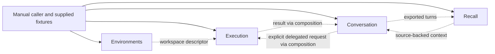

# Module design

Four-module boundaries retained from iteration 2. The user has endorsed this direction. [Module internals and stack](module-internals-and-stack.md) now provides proposed subdivisions, packages, database placement and a local runtime. Nothing authorizes implementation yet.

**Product clarification:** the owner wants OS-1-like shared presence. Current source access and reference resolution are required to make that believable; persistent storage alone is insufficient. [Shared context and presence](../product/shared-context-and-presence.md) identifies how these responsibilities fit the four modules without adding a fifth system.

## Design rule

A module must have a useful standalone exercise with explicit inputs and observable outputs. It may depend on an existing library or external product. It must not require another unfinished JARVIS module merely to be developed or evaluated.

Manual input is a valid first caller. A prepared directory can substitute for workspace provisioning; exported records can substitute for a live conversation feed. Substitutes satisfy the same boundary shape but do not prove real integration, production durability or security. Each module is evaluated separately, then the actual connection is evaluated when introduced.

Keep product invariants firm: persistence outside model sessions, isolated delegated work, explicit authority and evidence-backed outcomes. The companion stack document selects revisable defaults for storage, transports and local deployment; keep those behind module boundaries. Independent modules do not require independent microservices.

## 1. Execution

**Purpose:** perform a supplied task through an existing harness and make its lifecycle observable.

- Input: objective, caller-prepared workspace access, explicit authority/limits, optional context and expected artifact.
- Output: execution handle, progress, terminal outcome and artifact references.
- Owns: adapter configuration, mapping of native lifecycle to a small result vocabulary, native session reference and execution record.
- Integrates: Codex App Server over stdio as the proposed first adapter; its tool loop, subprocess handling and native facilities remain its responsibility.
- Does not own: intent discovery, long-term memory, environment provisioning, global scheduling or permission grants for other modules.

**Standalone exercise:** manually submit a repository-analysis task against a prepared isolated directory. Read progress, inspect the report, cancel another run and observe a deliberate failure. This needs the chosen harness and its supported credentials; it needs no other JARVIS module.

**BUILD:** a thin adapter and result handling. **INTEGRATE:** the harness. **REPLACEABLE:** the first provider and local presentation. Prefer an existing SDK/interface; do not duplicate its native functionality to make the adapter look richer.

Progress and outcome are useful even without recovery. The first boundary must distinguish failed, cancelled and unknown outcomes; automatic resume can wait until an actual interrupted task demonstrates what needs preserving.

## 2. Environments

**Purpose:** provide an execution location with known isolation and lifecycle properties.

- Input: requested resources, permitted imports, persistence need and required isolation.
- Output: workspace access descriptor, observed status and a release operation.
- Owns: its environment references, resource ownership, cleanup and supported persistence behavior.
- Integrates: rootless Podman on Linux for the first compute exercise; libvirt/KVM is the proposed extension for GUI/stronger isolation.
- Does not own: any model, harness, conversation or task planning.

**Standalone exercise:** prepare an environment, import a fixture, inspect it with an ordinary command, stop/restart if supported, and release it. Verify that forbidden host resources are unavailable. No agent needs to run.

**BUILD:** only lifecycle glue and the descriptor mapping. **INTEGRATE:** isolation and lifecycle machinery. **REPLACEABLE:** container/VM/backend. A single backend is enough to evaluate this boundary; do not build a universal environment manager.

Execution can initially consume a manually prepared descriptor. Environments can initially serve a manual caller. Their eventual integration should replace the manual preparation, not rewrite either module. Remote access and snapshots are optional capabilities; unsupported restoration is reported explicitly.

## 3. Recall

**Purpose:** turn supplied records into useful, source-backed context for a supplied question.

- Input: source records with stable references and visibility labels; a query and authorized source scope.
- Output: relevant excerpts or claims, source references and limitations.
- Owns: its ingested corpus or indexed copies, ingestion receipts and derived search state.
- Integrates: SQLite relational queries and FTS5 first; extraction and semantic retrieval remain optional additions justified by recall evaluation.
- Does not own: the canonical live conversation, execution history service, identity authority or workflow engine.

**Standalone exercise:** ingest a fixed set of synthetic conversations and notes; ask known-answer, ambiguous and historical questions; inspect evidence; remove a source and ensure it stops appearing. No live agent or conversation client is required.

**BUILD:** JARVIS-specific recall/evidence policy where existing software leaves a gap. **INTEGRATE:** retrieval/extraction primitives or a suitable memory package. **REPLACEABLE:** storage and search strategy. Begin by evaluating useful retrieval; automatic fact curation is not a prerequisite for recall.

## 4. Conversation

**Purpose:** preserve an interaction independently of a provider session and supply the recent turns for continuation.

- Input: user turns, conversation reference and optional supplied context.
- Output: assistant turns plus durable conversation history.
- Owns: canonical turns and their ordering, provider-session references and explicit identity instructions.
- Also needs for shared presence: a bounded current-topic/shared-source context and reference resolution. This is a proposed responsibility, not a capability already supplied by the model SDK.
- Integrates: the official OpenAI TypeScript SDK and Responses API for the first text provider; model selection remains configurable.
- Does not own: execution, recall, workspace control or proactive work.

**Standalone exercise:** exchange turns, close the caller, reopen the history, and continue. Exercise persistence with a deterministic provider substitute, then exercise the real provider separately. A fabricated provider response must never be confused with a successful live call.

**BUILD:** persistence and provider-independent continuity needed by JARVIS. **INTEGRATE:** inference. **REPLACEABLE:** model and store. The first conversation need not launch tools. Adding tools later should delegate to an existing harness rather than creating a new agent loop.

## Composition after standalone evaluation

Solid arrows are standalone entry points. Dotted arrows are optional future data flows, not startup dependencies or compulsory direct imports. The conversation/recall cycle is an export-and-query relationship, not a shared transaction or recursive invocation.

Composition initially means explicit application wiring: obtain a descriptor and pass it to execution, or query recall and pass the returned context into a conversation request. Add correlation references here only when useful. Do not make modules adopt a universal task/state model beforehand.

The first two useful compositions are independent choices:

- **Execution + Environments:** replace manual environment preparation with a real provider; prove the same bounded task still works and releases resources correctly.
- **Conversation + Recall:** import saved turns and request cited context; prove conversation remains usable while recall is unavailable.

A conversational request that starts work comes later, once explicit delegation and result handling are useful. Long-running orchestration earns its own design when there is a concrete monitor or approval wait to preserve. Evaluate an existing durable engine at that point; do not require it for ordinary execution.

## How the rest of the vision fits

| Product capability | Natural future connection | Evidence needed before selecting technology |
| --- | --- | --- |
| Omarchy UI | Present execution and conversation through native surfaces | A useful module to expose; actual target OS/release |
| Shared user attention | Deliberate host/document observation into Conversation; source links into Recall | Real capture capability and evaluation of ambiguous references; distinguish the user's desktop from the agent workspace |
| Browser/GUI work | Existing tools/harness inside a compatible environment | A specific GUI task, isolation and input ownership |
| Voice | Conversational presence; early product experiment | Actual interruption and grounding behavior; text-only tests establish less |
| Phone continuity | Another client of owned conversation history | A second-device scenario and authority model |
| Proactive monitoring | Durable orchestration calling supplied module contracts | A restartable timed/event-driven use case |
| Home devices | Existing Home Assistant interface | Explicit action scope and verification |
| Multi-machine operation | Remote environment/provider connection | A real need beyond one machine, including partition behavior |

The core is the persistent product formed by these owned records and connections. It need not begin as a central platform service. The proposed local deployment hosts trusted modules together while keeping their SQLite files and APIs owned separately; Environments runs under its execution account. Every module still has a standalone caller mode. See the stack document for exact placement and trust limits.
